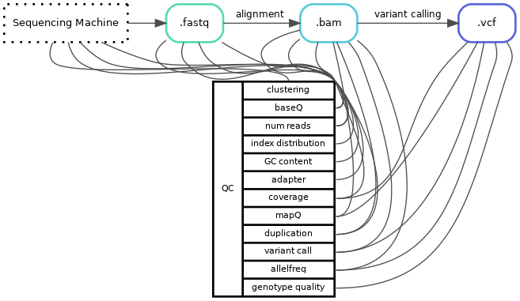
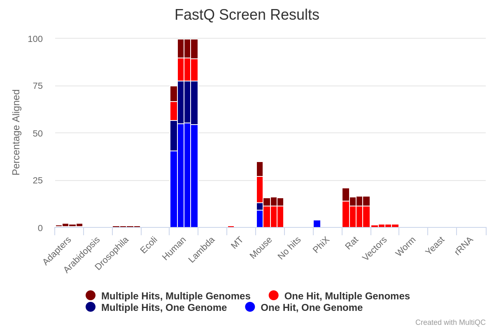
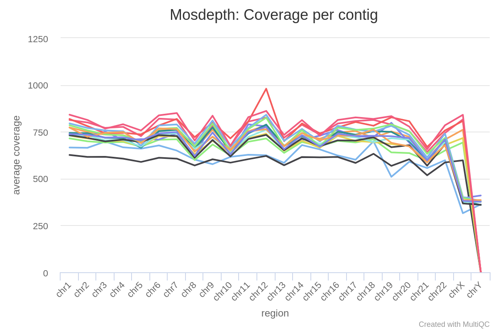
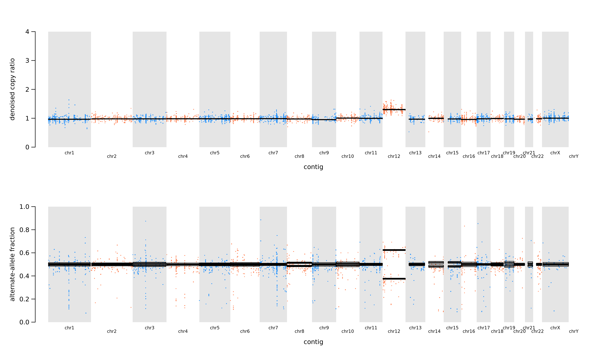
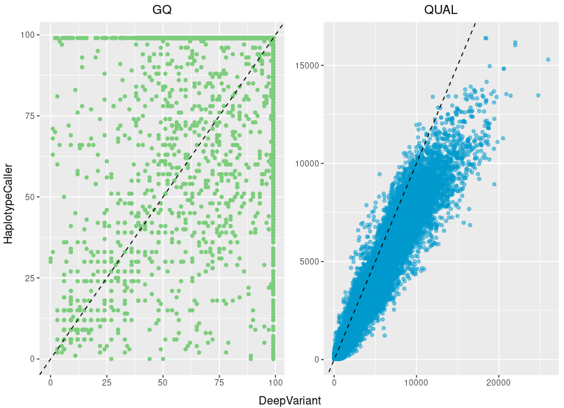

# Computer lab 2: Sequencing quality control

This computer lab picks up as the sequencing machine has finished. Even if the sequencing machine did run ok there is no guarantee that the data is actually what we expect and the quality is good enough to use in our downstream analysis.  
<br>
As the sequencing machine finishes it usually outputs some QC report, for Illumina machines this is in the Sequencing Analysis Viewer (SAV) file format but could also be a text file or similar. This QC-report usually contains information on how the sequencing went, i.e. how much data were produced, clustering and average basequality etc. If several samples were pooled there is also information on how much data each index(-pair) got, and how much of the data actually contains the specified indexes.

## Prerequisites
* IGV
* Web browser
* Access to Uppmax project (uppmax2024-2-1)

If running locally:

* Singularity
* awk

## Files
Can be found at the Uppmax project (uppmax2024-2-1).
To ensure that you don't accidentally overwrite someone elses file start by copying the entire `lab2_qc` folder to your home (or local computer).
Either download the entire folder locally or all work can be done in your own homefolder on Rackham.

```bash
mkdir ~/${course_folder}
cp -r /proj/uppmax2024-2-1/nobackup/lab_files/lab2_qc ~/${course_folder}
cd ~/${course_folder}/lab2_qc/
```

---

## Common Quality Values
While running a bioinformatic pipeline it is important to continuously collect QC-values, this ensures that each step work as expected and can help you identify where and what happened if something gives unexpected results or crashes.  
<br>
{: width:150%"}  
<br>

One issue or hurdle is that the same word can be used for different quality-values, it can also be the same value but calculated at different timepoints or the algorithm might differ depending on which program you use. For example duplication rate is a value of how many copies of the same read your library has, this can be estimated optically from the fastq-files or calculated after the reads have been aligned to your reference genome. Even if you calculate the duplication rate on the same file the algorithm can also differ between different programs (or even version of program). For example, how you define a duplicated read can differ, do you look at just the starting point or do you look at both the starting and end position of the reads. Therefore, it is **always** important to know how and on what file a value is calculated.  
<br>

Another important factor to keep in mind is what kind of library you are looking at, capture, amplicon, pcr-free or even long-read all differs in expected values and results, and the values are often not comparable across methods.
!!! abstract "Sequencing methods"
    **Short Read Sequencing**: most common sequencing method, read length ~50-150 bp.  
    **Long Read Sequencing**: allows for detection of complex SVs, read length ~5000-30000 bp.
    
    **PCR-free**: sequencing library created without the use of PCR amplification.  
    **(Hybridization) Capture**: target sequencing using baits to "fish out" regions of interest.  
    **Amplicon**: target sequencing using primers to amplify specific targets.  

<br>

### Number of reads
Number of reads are what they sound like, how many reads do you have in your sample file(s). Often this variable is used to check if the sequence machine and pooling behaved as expected. This number is also used to calculate pooling, or expected output if you change flowcell/sequencing machine size.  

Number of reads are calculated either directly in the sequencing machine, raw fastq or even the aligned bamfiles.  

!!! question "Question 1"
    :question: If you get a lower number of reads for a sample than expected, what could be the cause of this (wet lab errors, input file errors, sequencing machine errors, analysis errors)? 
<br>
Example of programs that calculate Number of Reads:

* SAV/sequence machine run stats
* [FastQC](https://www.bioinformatics.babraham.ac.uk/projects/fastqc/)
* [Samtools stats](http://www.htslib.org/doc/samtools-stats.html)
* [Picard HSMetrics](http://broadinstitute.github.io/picard/picard-metric-definitions.html#HsMetrics)

!!! question "Question 2"
    :question: Explain why the parameter "Number of Reads" differ between different programs for this Illumina Nextseq run of 16 capture samples.

    |  <br />**Sample** | SAV: <br />  **`Total reads`** | FastQC: <br /> **`Total Sequences`** | Samtools stats: <br /> **`raw total sequences`** | Picard HSMetrics: <br /> **`TOTAL_READS`** | 
    | --- | --- | --- | ---- | --- |
    | SampleA | <br /> 160M {: rowspan=2} | 5M | 8M | 10M |
    | SampleB | 5.3M | 9.2M | 11M |

    ??? tip
        Commands used to produce QC output:  
        **FastQC**: `fastqc --quiet --outdir qc/fastqc/ fastq/sampleA_R1_001.fastq.gz`  
        **Samtools stats**: `samtools stats -t design_file.bed alignment/sampleA.bam  > qc/samtools_stats/sampleA.samtools_stats.txt`  
        **Picard HsMetrics**: `gatk CollectHsMetrics -COVERAGE_CAP 500 -BAIT_INTERVALS design_file.intervals -TARGET_INTERVALS design_file.intervals -INPUT alignment/sampleA.bam -OUTPUT qc/picard_collect_hs_metrics/sampleA.HsMetrics.txt`  
<!-- 
Svar:
fastqc 9 389 272 endast R1
samtools 10 272 580 med bedfile
hsmetrics 18 778 544  hela bam 
SAV hela korning 100M-1.2B 
-->

### Percent [%] mapped

After trimming away low quality reads and bases, the reads are aligned to a reference genome. The percent of reads that are mapped is often tracked during this step. This is to measure how well your data match the genome reference provided. This value is usually provided as a QC value from the alignment software you have used, e.g. [bwa](https://bio-bwa.sourceforge.net/) or [minimap2](https://github.com/lh3/minimap2) or any QC-checks done on aligned files.   

One program that uses a different approach is [Fastq_Screen](https://www.bioinformatics.babraham.ac.uk/projects/fastq_screen/_build/html/index.html#). Fastq Screen roughly aligns fastq-reads to a reference genome database, and compare the amount reads aligned between the different references. 

!!! question "Question 3"
    :question: Explain what you see in the following Fastq Screen result of 4 separate samples (SampleA-D):

    
    

### Coverage
A measurement of how well covered your sample is. Usually defined as *"Y" X coverage*, where for example 40X coverage is normal in whole genome sequencing (WGS). This means that the average position is covered by *Y* number of reads. There are many different programs that calculate coverage (often in combination with other QC parameters), some examples are:

- [Samtools Stats](http://www.htslib.org/doc/samtools-stats.html)
- [Picard CollectAlignmentSummaryMetrics](https://gatk.broadinstitute.org/hc/en-us/articles/13832683660955-CollectAlignmentSummaryMetrics-Picard-)
- [Mosdepth](https://github.com/brentp/mosdepth)

!!! question "Question 4"
    :question: Calculate the average coverage of TP53's exon3 (hg19: chr17:7579312-7579590) in SampleB with mosdepth.  
    Either you do this locally on your computer (need to have singularity available), or on Uppmax.  
    *(Bam-file aligned to Hg19 reference genome.)*  

    ```bash
    cd ~/${course_folder}/lab2_qc/
    module load bioinfo-tools
    module load mosdepth/0.3.3
    mosdepth sampleB-output ${path_to_file}/sampleB_subset.bam
    ```

    or if using singularity locally you need download bamfile and index files from Uppmax first, and then run mosdepth locally using singularity
    ```bash
    # Files needed: sampleB_subset.bam and sampleB_subset.bam.bai
    singularity exec docker://hydragenetics/mosdepth:0.3.2 mosdepth sampleB-output sampleB_subset.bam
    ```
    
    ??? tip
        Looking into [mosdepth documentation](https://github.com/brentp/mosdepth) or using the built-in help `mosdepth --help`, is there a parameter that can help you restrict you calculation to only the region of interest?
        
        ??? tip 
            How would you translate the region into a bedfile format?  
            `chrA    X   Y`  
            To get the coordinates into a file you can use echo:  
            `echo -e "chrA\tX\tY" > design.bed `  
            The `-e` will ensure that echo translates the `\t` to a tab.  

#### Coverage distribution
Coverage distribution describes how the aligned reads are divided over the reference genome. Are they isolated to certain areas? Are some areas not covered properly? Are all regions covered the same?  
Just like you did in [lab 1](lab1.md#assignment-3), you can identify sequencing method by just looking at the distribution i.e. in the coverage track in IGV. In-depth coverage distribution is also used to estimate CNVs by most CNV-algorithms.  



!!! question "Question 5"
    :question: Looking at the coverage distribution (above) for 16 samples (same capture panel, same sequence run), what stands out? 
    ??? tip
        Are there a difference between autosomal and sex chromosomes?  
        ??? tip "Autosomal chromosomes"
            Looking at the autosomal chromosome there is one sample that stands out. This is its CNV profile. What does that tell us?  
            
        ??? tip "Sex chromosomes"
            How many copies do we have of the sex chromosomes compared to autosomal, and how does this correlate to coverage?  


#### Fold80
A more quantitative value based on coverage distribution is the fold 80 base penalty value calculated by e.g. [Picard CollectHsMetrics](http://broadinstitute.github.io/picard/picard-metric-definitions.html#HsMetrics). The **Fold80** is defined as the fold change of non-zero read coverage needed to bring 80% of the ROI bases to the observed mean coverage, or a bit simpler put: how much more sequencing is required to bring 80% of the target bases to the mean coverage. So for a fold80 of 1.3 (which is a good value) 30% extra reads would be enough to bring 80% of the targets bases up to mean coverage.

#### Coverage breadth
Yet another common measurement of coverage is coverage breadth, or **% &ge; Yx** as it is often described as. This means that X % of the genome or target regions is covered by **at least** Y reads. By default several of these levels are calculated in most of the [Picard](http://broadinstitute.github.io/picard/picard-metric-definitions.html) metrics programs (depending one your sequencing method which collect metrics you run may vary). Since this is such a popular value many coverage programs often calculates breadth and allows you to specify your own specific thresholds if needed. The most common program used are the [Picard metrics](http://broadinstitute.github.io/picard/picard-metric-definitions.html) algorithms. Since this is a measurement of coverage over a given **target** it is important to keep track of what region/target this is calculated over to be able to compare numbers.

---

:question:    Why might the coverage breadth vary for the same human WGS (reference genome HG38) sample (same fastq files used) calculated with different pipelines? Discuss using the following keywords: target, qc-program, read filtering.

| Name | PipelineA: Median Cov | PipelineA: % &ge; 30x | PipelineB: Median Cov | PipelineB: % &ge; 30x |
| --- | --- | ---| --- | ---|
| SampleC | 34 | 91 | 34 | 99 | 

---


### Duplication rate
The duplication rate is the fraction of mapped reads marked as duplicate reads in a particular data set. In contrast to overlapping reads, duplicate reads offer no additional information and are removed from sequencing data during the bioinformatic pipeline, a process known as deduplication. With other words  duplicate reads are identical reads which are an artifact/bias introduced by a method; biological or technical (usually but not exclusively PCR), and will not give any new information and should therefore be flagged and remove from your dataset.  

As for most QC-values, duplication rate can be calculated at many different stages and the definition can vary depending on algorithm.

The most common program for calculating the duplication rate on **unaligned reads** is [FastQC](https://www.bioinformatics.babraham.ac.uk/projects/fastqc/). FastQC can either be a part of the bioinformatic pipelines or on some newer sequencing machines it is included in the "SAV".

For **aligned reads**, [Picard MarkDuplicates](https://gatk.broadinstitute.org/hc/en-us/articles/360037052812-MarkDuplicates-Picard-) is the most common program that identifies, flags and records outputs statistics of duplicates reads, but there are plenty of other programs and in-house solutions that does the same thing. Picard also has a program called [Collect Duplicate Metrics](https://gatk.broadinstitute.org/hc/en-us/articles/360057441491-CollectDuplicateMetrics-Picard-) which calculates the duplication rate on a previously duplication-marked bamfile.
<!-- 
#### Unaligned
Fastqc 100 000 reads 50 bp identical
#### Aligned
picard, mapped 5' end of read -->

!!! question "Question 6"
    Use the files in `lab2_qc/`-folder answer the following questions:  
    :question: Find the estimated duplication rate for sampleD from both FastQC and Picard CollectDuplicateMetrics. Fill in values in the table in question 7.
    ??? tip
        Checkout the output from the different programs under the `qc`-folder.
    :question: Explain why the duplication rate differs between FastQC and Picard MarkDuplicates/CollectDuplicateMetrics?
    ??? tip
        Check-out [FastQC's](https://www.bioinformatics.babraham.ac.uk/projects/fastqc/Help/) documentation and compare it with [Picard Markduplicate's](https://gatk.broadinstitute.org/hc/en-us/articles/360037052812-MarkDuplicates-Picard-).

---

| Sample  | Total sequences (M Seqs) | Duplication rate | Mean Coverage |  Fold80 |
| --- | --- | --- | ---- | --- |
| SampleD | | FastQC: <br />CollectDuplicateMetrics: |  |  |
| SampleE | | FastQC: <br />CollectDuplicateMetrics: |  |  |

!!! question "Question 7"
    :question: Fill out the table above with the missing values for sampleD.

    ??? tip
        Navigate the different outputs under the `qc`-folder to find the missing values for sampleD.
        ??? tip "Programs"
            Number of reads: fastqc  
            Duplication rate: fastqc or collect duplicate metrics  
            Median coverage: mosdepth  
            Fold80: Picard HsMetrics


        

## MultiQC
As you might have notice it takes quite a while to identify and find the different QC-values to track. To combat the never-ending file searching and enable easier tracking of QC-values the program [MultiQC](https://multiqc.info/) is often used. MultiQC aggregate the different QC-values into a single report. MultiQC **only** aggregate results from other programs (over [100 tools](https://multiqc.info/modules/) are automatically included, but you can also build your own tables or plots) and never does any calculation, therefor what values you can find and the layout of a MultiQC report varies a lot. It all depends on which programs you have run and input into MultiQC. MultiQC also allows you to configure almost all parts of the report with a config so a MultiQC-report does not always look like a "MultiQC-report".  

<br>
The report is a self-contained interactive `.html`-file where you can adapt/configure/highlight etc the plots and tables directly in your web-browser. It also allows for an easy export of table and plots if needed. 
!!! question "Question 8"
    :question: Open the provided MultiQC-report (`lab2_qc/MultiQC_DNA_report.html`) and "play around" with the different tools and parameters. Once you feel ready upload a screen-print of the MultiQC report with sampleP highlighted.

!!! question "Question 9"
    :question: Fill in the same table as in Question 7 but for SampleE with the values found in the MultiQC report.
    ??? tip 
        For all MultiQC tables you can configure and choose which columns to view by clicking the **:material-dots-grid:Configure Columns**-button.

## Variant Quality
The next step after you have validated the quality of the sequencerun is variants. How do we know that a variant we see is real and not an artifact?

### BaseQ and MapQ
There are several different ways and steps to validate a variant. Most variant callers have build-in filtering steps that ensures that the variants reported are filtered or at least flagged if the confidence is low. One of the most basic way is to look at the [base quality](lab1.md)<!--find specific passage about phredsscore --> of the variant's alternative bases. However, the baseQ vary depending on sequencing [machine and/or version of said machine](https://en.wikipedia.org/wiki/FASTQ_format#Encoding). A good rule-of-thumb is that you always want at least a phred-score of at least 20 to be able to trust a base-call.

The other quality-value that is usually included are mapping quality, how well a read has aligned to exactly that specific region of the reference genome. Different aligners use different scoring algorithm and therefore it is hard to compare quality values across programs. For some more in-depth reading see [here](http://www.acgt.me/blog/2014/12/16/understanding-mapq-scores-in-sam-files-does-37-42) and [here](https://davetang.org/muse/2011/09/14/mapping-qualities/) for example.

!!! question "Question 10"
    :question: Open `.bam` file called `sampleD_subset.bam` in IGV, and navigate to `chr17:7577114`. How many `T` calls have a basequality below Q30?
    ??? tip
        Sort the position based on base (right click -> sort by -> base). Under view -> preferences -> alignments make make sure that  `shade mismatched bases by quality` is checked.

<!-- 14              -->

### Genotype Quality
Most variant callers have some sort of genotype quality scoring available for each variant call. The problem here is that it is not standardized and each caller can have completely different values making them hard to compare. For example for GATK produced vcf-files there are several different quality values, there is the `QUAL` column as well as the `GQ` and `PL` fields in the FORMAT column. For more in-depth info on the different vcf columns and annotation for GATK see more info [here](https://gatk.broadinstitute.org/hc/en-us/articles/360035531692-VCF-Variant-Call-Format). While other programs might also call their quality value by the same name, their definition is often completely different. 



If we compare two variantcallers ([GATK's Haplotypcaller](https://gatk.broadinstitute.org/hc/en-us/articles/360037225632-HaplotypeCaller) and [Google's Deepvariant](https://github.com/google/deepvariant)); both specialized on germline calling, both use the flag `GQ` and the `QUAL` column as a quality measurements, we see a clear difference on both of the quality scores for the same variants. That said, the genotype quality score is not useless, but actually a good quality measurement of a variant call, you just always have to know how the file were produced and what scoring thresholds are considered "good" for that specific program. 

### Background and artifacts
Another step for validating your variant is eliminating the risk that the variant actually is a sequencing artifact or just background from a "messy" region.  

To identify artifacts you have to be able to separate the real variant calls from the variants that look like a real disease causing variant but is actually a call introduced by of some sort of bias. What further complicates the process is that since in sequencing we use organic enzymes and proteins we often introduce artifacts in the same region as the cell might have trouble processing the DNA, such as long repetitive sequences or homopolymers. Some artifacts are easier to identify than others, for example sequencing chemistry can affect our ability to sequence certain areas.

!!! question "Question 11"
    :question: What is the most classic artifact introduced by 2-color chemistry in the Illumina sequencing?

To identify background noise you need to separate an actual call to the normal noise or distribution of basecalls. No technique has 100 % base recall, and even if that was the case we still primarily sequence short-read today, there is always a chance that your read actually originates from somewhere else. Most background is below 5 % allele frequency otherwise it moves towards being an artifact, so for most high frequency variants we are safe. The problem arises when we want to be able to detect low frequency variants. To be able to detect low frequency variants we have to sequence deeper and have greater prior knowledge of the methods. 

Both background and artifacts is a lot easier identify if a normal pool of samples is available to compare your data with. A normal pool consists of a number (the more the better) of "healthy" samples processed identical (or as close as possible) as your sample. Small and big biases are always introduced what ever we do, therefore it is important to spread out the normal samples in several batches to mitigate batch-bias. And different sequencing machines use different chemistry you need a normal-pool for each machine type you plan to include. 

<br>

---

## Extra assigment
**Coverage breadth**

Finding coverage breadth is not always easy. In the mosdepth_bed folder, locate the `qc/mosdepth_bed/sampleD_T.thresholds.bed.gz` file and have a look inside it with `less ${file}` (use `q` to exit).  

:question: Fill in the table for coverage breadth for sampleD. You want the total coverage breadth, not per region.  

| Sample  | % &ge; 200x | % &ge; 500x |
| --- | --- | --- |
|sampleD | | |

To calculate the % &ge; Yx you need to add together coverage for the entire design and then divide it by the total length of the design: 
    $$ \frac{\sum covered\ bases} {\sum region\ length} $$
        
For example:

|  |  |  | 10x|
|---|---|---|---|
|chrA |1 |11|2|
|chrA|20|25|0|

Would give us $$ \frac {(2+0)} {(11-1)+(25-20)}=0.1333... $$ i.e. 13.3 % &ge; 10x

??? Tip
    Try piping the output from `zcat` (to open the gzipped file "on/the/fly") to [`awk`](https://linuxhandbook.com/awk-command-tutorial/) to calculate the coverage breadth using the formula above. 

    ??? Tip "Full command"
        Identify which columns you are interested in and use it to replace `$x` with the column number (1-index) in the script below:
        ``` bash
        zcat qc/mosdepth_bed/sampleD_T.thresholds.bed.gz | awk 'NR>1{tot_length+=$3-$2;tot_bases+=$x}END{print tot_bases"/"tot_length"="tot_bases/tot_length}'
        ```
        
        Step-by-step explanation:
                
        *   `zcat` allows for reading the gzipped file without extracting it.
        *   [`awk`](https://www.geeksforgeeks.org/awk-command-unixlinux-examples/) is a handy string manipulating program
        *   `NR>1` means skip the first line since that line is the header.
        *   `tot_length+=$3-$2` is a cumulative variable that increases with the length of the region for each row. The values in column 2 is subtracted from column 3 and the sum is added to the variable `tot_length`.
        *   `tot_bases+=$x` is the cumulative value of your desired column.
        *   `END` just means do the following once the end of the file is reached.
        *   `print ` print the following to the command line.
        
        Compare your values with the value found in MultiQC.

:question: See if you can find a way of calculating the coverage breadth of 450x for sampleD_subsample.

??? tip
    Which program was used to produce the original file? Is there a way of change the input parameters to calculate different level of coverage breadth?
