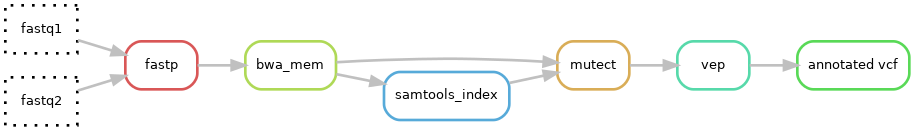

# Computer lab 4 - Somatic variants
In this computer lab we are going to explore different kinds of somatic variants. The type and location of the variant can have an affect on the treatment of the cancer patient.

## Overview
1. Explore different somatic variants in IGV
2. Look at a gene fusion
3. Run a small somatic pipeline
4. Variant annotations in a vcf file
5. Somatic copy number variations

## Prerequisites
* [IGV](https://igv.org/) - Desktop application or web app
* Shell / terminal / putty
* rsync

## Files
Login to [pelle](https://docs.uppmax.uu.se/cluster_guides/pelle/) on UPPMAX.
Download the lab 4 files to your home directory on pelle (UPPMAX).

```bash
cp -r /proj/uppmax2024-2-1/nobackup/lab_files/lab4_somatic/ ~/
cd lab4_somatic
```

It is also recommended to download the files to you local computer (if you have not done that already) using scp, [FileZilla](https://uppsala.instructure.com/courses/115337/pages/things-to-do-before-the-course-starts) or similar (for easier viewing of bam, html, and pdf files). Example using scp on you local machine (exchange {username} with you own username on uppmax):

```bash
scp -r {username}@pelle.uppmax.uu.se:~/lab4_somatic .
```

## Links to resources
* [Genetic variants explained](https://bitesizebio.com/23996/whats-so-important-about-variants/)
* [The role of fusion genes in cancer](https://www.ncbi.nlm.nih.gov/pmc/articles/PMC7931065/)
* [Fusion caller: Arriba](https://github.com/suhrig/arriba/wiki/01-Home)
* [CNV caller: CNVkit](https://cnvkit.readthedocs.io/en/stable/pipeline.html)
* [CNVkits explanation of log2 ratio](https://cnvkit.readthedocs.io/en/stable/calling.html)

## Somatic variant types
Lets first explore some different types of variant that can occur in a somatic sample. 

### IGV
Open IGV and then open the `HD832_T.variant.genes.bam` file, make sure that the reference genome is set to **Human hg19**. 

### IGV settings
Somatic with low allele frequency does not show up in coverage track. To mitigate this **Right-click on coverage track, then Set allele frequency threshold to 0.05.**

### Variants
In the regions below there are different type of variants or mutations. For additional information regarding genetic variant types see [genetic variants explained](https://bitesizebio.com/23996/whats-so-important-about-variants/). **In Questions 1 - 4 we use the same regions so it might be convenient to answer all these question at once for each region.**

**Regions:**

* chr7:140453022-140453248
* chr2:29416330-29416416
* chr7:140434558-140434634
* chr3:41265991-41266273
* chr2:29416005-29416044

!!! TIP
    * Copy the regions into IGV
    * Zoom in when needed
    * Left click on positions in the coverage track to see support for each allele
    * Right click in the read track and choose Collapsed or Squished to see more of the data

!!! question "Question 1"
    :question: 
    In the regions above there are variants, determine which variant is of which type (there can be more than one). **Only variants with allele frequency above 5%** should be considered as this is the limit used in the clinic for this sequencing panel.

    * Region with many artifacts
    * Somatic SNV
    * Germline SNV
    * Deletion
    * Insertion

!!! question "Question 2"
    :question: 
    **In question 2-4, ignore the artifact region.** Determine the exact genomic starting position of the variants for all non-artifact variants

!!! question "Question 3"
    :question: 
    Determine the number of supporting reads for all non-artifact variants

!!! question "Question 4"
    :question: 
    Determine the allele frequency for all non-artifact variants. **Allele frequency for deletions and insertion need manual calculations**
    ??? note
        IGV uses all reads available in the bamfile, no filtering except duplicate reads is applied by default. Therefore the calculated "raw" allele frequency from IGV does not always correlate with the AF found in vcf-files since callers perform additional filtering of reads before calculating AF.

---

### Fusions
Now, lets look at a fusion event (chromosomal rearrangement) between the genes FGFR3 and TACC3. The role of fusions in cancer is summarized in this [scientific paper](https://www.ncbi.nlm.nih.gov/pmc/articles/PMC7931065/). In short, a RNA fused between two genes in-frame is translated into a novel fusion protein that may act as a potent oncogenic driver. Kinase genes are often partners in such fusions. Kinase fusions often retain kinase activity and result in ligand-independent activation and enhanced downstream signaling that leads to carcinogenesis.

1. Make a new session in IGV or open a new window.
2. Open the file `RNA-SeraSeq_R.FGFR3.TACC3.bam` in IGV. 
3. Copy and paste both of the following regions into IGV at the same time:
> chr4:1807661-1809661 chr4:1738429-1744429

!!! question "Question 5"
    :question:
    This is RNA sequence data from a capture design where only the FGFR3 gene was captured and not TACC3. How come we can see reads in the TACC3 gene anyway given that there is a gene fusion between these two genes?

### Fusion break point
Using the current visualization settings it is hard to see the fusion break point. We should therefore change the settings in IGV so that soft clipped bases are shown (rainbow colored reads). These are reads where only part of the sequence match to the reference sequence and the other part matches somewhere else in the genome.

1. Open the View menu
2. Choose Preferences
3. Choose the Alignment tab
4. Scroll down and check the box named "Show soft-clipped bases"
5. Click the Save button

!!! question "Question 6"
    :question:
    Using the gene track and a transcript of your choice determine in which exons the fusion has occurred. Specify both exon and transcript ID (NM_XXXX) in your answer.

### Fusion visualization using the Arriba fusion caller
Somatic fusion calling can be performed by a number of different callers. One such caller is [Arriba](https://github.com/suhrig/arriba/). The nice thing with this caller is that the fusions that they call are [visualized]https://arriba.readthedocs.io/en/latest/visualization/)(https://github.com/suhrig/arriba/wiki/06-Visualization) in a very clear and informative way. 

Open the pdf file `RNA-SeraSeq_R.arriba.fusions.pdf` produced by Arriba. The first fusion in this document is the same one that we previously studied in IGV, FGFR3::TACC3. Here we can see the fusion breakpoint as well as the direction and if it is in-frame. This together with the included protein domains in the fusion product is important to determine if the fusion is clinically relevant.

!!! question "Question 7"
    :question:
    What role does the ongogenic FGFR3::TACC3 fusions play in cancer?
    
    For example, the function of the fused protein, clinical target and drugs, prevalence, etc.

<br/>
Scroll further down in the document to find additional fusions that Arriba has found. Usually only one true fusion is found per sample but in this case it is a synthetically created sample with many clinically relevant fusions. 

---

## Variant annotation in vcf
Use the `grep` or `bcftools` (use module load BCFtools first on Pelle) command on the vcf-file `HD832_T.filtered.vcf` to investigate the variants found earlier. 

Investigate the annotation of the SNV found in the region chr7:140453022-140453248. 

!!! question "Question 8"
    :question:
    What effect does the variant have on the protein sequence? **Answer with amino acid number and change**

!!! question "Question 9"
    :question:
    Does it seem to be clinically relevant? Motivate!

---

## Copy number variation (CNV)
In cancer cells there is quite common with large and numerous copy number alterations, especially in certain solid tumors like lung cancers. Here, we are going to look at how it can look in a few solid cancer samples. CNVs are called by cancer specific callers like [CNVkit](https://cnvkit.readthedocs.io/en/stable/pipeline.html).

### Normal sample
However, lets start with how it looks in a normal sample without alterations. Open `CNV/normal_sample.cnv.html` in a browser. The first plot show the zoomed-in view of the data and the second plot an overview of the entire genome. There is also a table to the right with potentially clinically relevant CNVs. Consider the tips below and play around with the data in the CNV html report.

!!! TIP
    * Click on a chromosome in the overview to show it in the top plot.
    * In the top plot, left-click and drag to zoom in.
    * In the top plot, left-click to zoom out to chromosome view.

!!! NOTE
    Log2ratio is the copy number in the sample and is calculated as a ratio to the expected number of copies (diploid genome = 2) and then $ \log_2 $ is applied. A normal copy number of 2 is therefore $ \log_2(\frac {2}{2})=\log_2(1)=0 $. 
    
    If the sample instead have an extra copy then $ \log_2(\frac {3}{2})=\log_2(1,5)=0.6 $ 

    Or one lost copy is $ \log_2(\frac {1}{2})=\log_2(0,5)=-1 $.  

    However, this only applies if the tumor content is 100%. Otherwise, the effect of a somatic CNV will be smaller as only a subset of the cells are affected. See further [CNVkits explanation of log2ratio](https://cnvkit.readthedocs.io/en/stable/calling.html).

!!! NOTE
    The VAF-plots show the allele frequencies of heterozygous **germline** SNPs in the sample. When there is a somatic deletion or duplication the allele frequencies will increase or decrease depending on the allele. This is used as additional evidence of amplifications and deletions. Sometimes the genome can have two copies of the same allele and no copies of the other allele. This case will only show up in the VAF-plot as the copy number looks normal. This is called a [copy number neutral loss of heterozygozity](https://en.wikipedia.org/wiki/Loss_of_heterozygosity).

### Sample with CNVs
Now, lets consider a sample with large chromosomal alterations: `CNV/tumor.cnv.html`. 

!!! question "Question 10"
    :question:
    Based on the Genome view, which chromosomes have large deletions?  (Always take special care when looking at the X chromosome)

!!! question "Question 11"
    :question:
    Based on the Genome view, which chromosomes have large duplications?

### Sample with clinically relevant amplification
In this sample (`CNV/EGFR_amp.cnv.html`) there is an amplification of EGFR. Cancers with this amplification are often resistant to tyrosine kinase inhibitors and can therefore affect the treatment of the patient. 

Find the EGFR amplification and zoom in on the gene.

!!! TIP
    **OBS!!! When there are really high amplifications the data is sometimes outside the default scale. Click the box "Zoom to data extent" to see all the data.**

!!! question "Question 12"
    :question:
    What is the approximate log2 ratio, based on the plot, of the EGFR amplification? **Do not miss the tip above!**

!!! question "Question 13"
    :question:
    The table reports the copy number of the EGFR amplification after taking tumor content into account. What is the actual copy number found in the tumor based on the table?


### Sample with clinically relevant deletion
In the sample `CNV/CDKNA_B_del.cnv.html` there is a homozygous deletion of the gene CDKN2A and CDKN2B. This is a diagnostic marker in some cancer types, associated with poor prognosis. 

Find the CDKN2A and CDKN2B deletion. 

!!! question "Question 14"
    :question:
    Based on the copy number plot and the VAF-plot it seems that most of chromosome 9 has only one copy in the tumor (heterozygous deletion). Motivate, based on both the log2 ratio and the VAF plot why the region around CDKN2A and CDKN2B are a homozygous deletion in the tumor (both alleles deleted).

## Run a simple somatic pipeline
A sequencing machine usually does not directly generate the VCF files needed for diagnosing a patient. Instead, it produces fastq files. These files need to be processed by a collection of tools, forming a pipeline, to generate the VCF files required for diagnosis.

In this exercise we will run a simple pipeline that will generate an annotated VCF file. The different tools that will be executed can be seen in the following image.



The different tools that will be run are:

1. fastp: filters out low quality reads and removes adapter sequences.
2. bwa mem: align reads against the provided reference genome.
3. samtools index: creates an index file for the bam file necessary for subsequent tools.
4. mutect2: a caller capable of identifying SNV, insertion and deletion variants.
5. vep: an annotating tool that facilitates the analysis and prediction of the functional consequences of variants.

!!! Info
    The pipeline is written in Snakemake, which based on rules and output files requested decides what tools need to be run and in which order. It also handles submitting the jobs to the computer cluster, which in this case is Snowy. The pipeline can also be continued if canceled or partially rerun if some part of it is changed. 

### Start an interactive job
UPPMAX is not happy if we run to much on the head node so we need to start an interactive job
```sh
# on Pelle
interactive -A uppmax2024-2-1 -t 2:00:00
```

### Setup environment
To run the pipeline Snakemake needs to be installed.
```sh
# Enter pipeline folder
cd ~/lab4_somatic/pipeline

# load python and slurm library 
module load Python slurm-drmaa

# Setup environment
python -m venv venv && source venv/bin/activate
pip install -r requirements.txt
```

### Run
```sh
# Run pipeline
snakemake -s Snakefile --profile profile
```

### Find a variant

The output will end up in folder named analysis

!!! question "Question 15"
    :question:
    Find and report an somatic SNV (single nucleotide variant) from the gene ALK that is found in less than 1% in the population?

!!! TIP
    * Look at the annotated vcf file under analysis.
    * MAX_AF field in the VEP annotation can be used to determine the maximum observed frequency in the global population.
    * BCFtools can be a useful tool here instead of counting columns
    
---

## Extra CNV questions
!!! question "Extra question 16"
    :question:
    Look at the VAF-figure in chromosome 3 as an example. Why is the signal (the size of the separation between dots) stronger for a deletion than a duplication?

!!! question "Extra question 17"
    :question:
    Consider a hypothetical case where one chromosome has two copies according to the log2 ratio plot at the same time as there is a clear separation in the VAF-signal plot (all SNPs far away from 50% in allele frequency). What has happened to the chromosome in this tumor to explain these data?

!!! question "Extra question 18"
    :question:
    Consider another hypothetical case where the chromosome with log2 ratio of 0 has a clear separation in the VAF-signal plot while there are chromosomes with both higher and lower log2 ratios that have no VAF-signal. What has happened to the genome in this tumor to explain these data?
